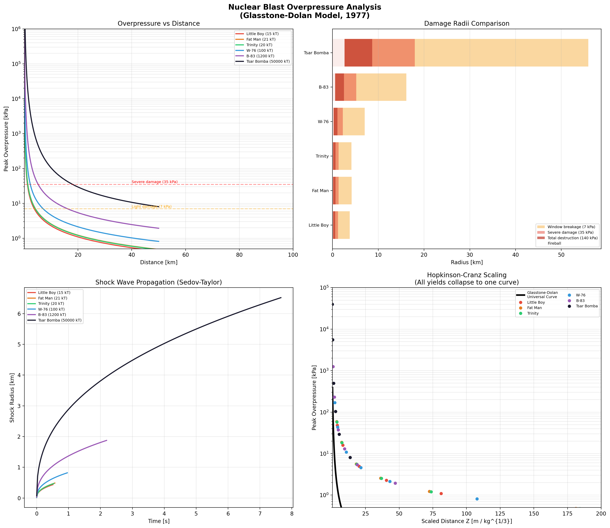
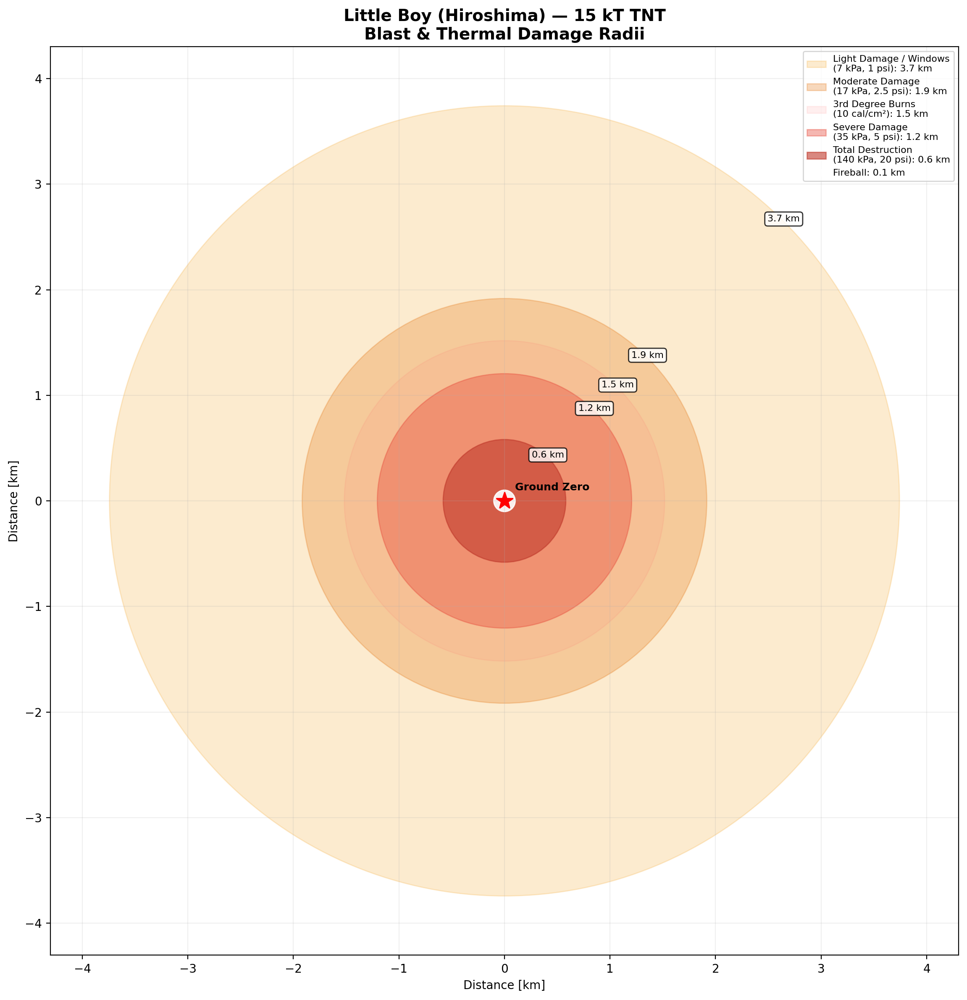
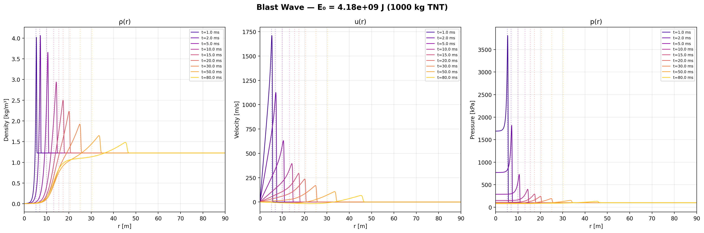
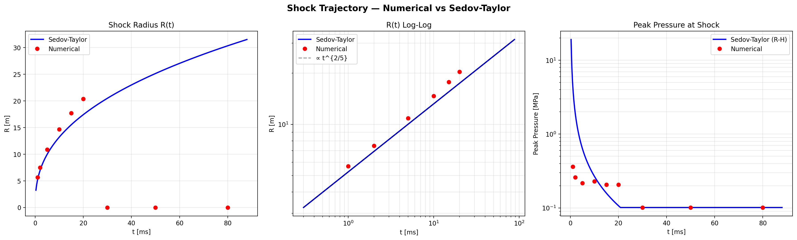
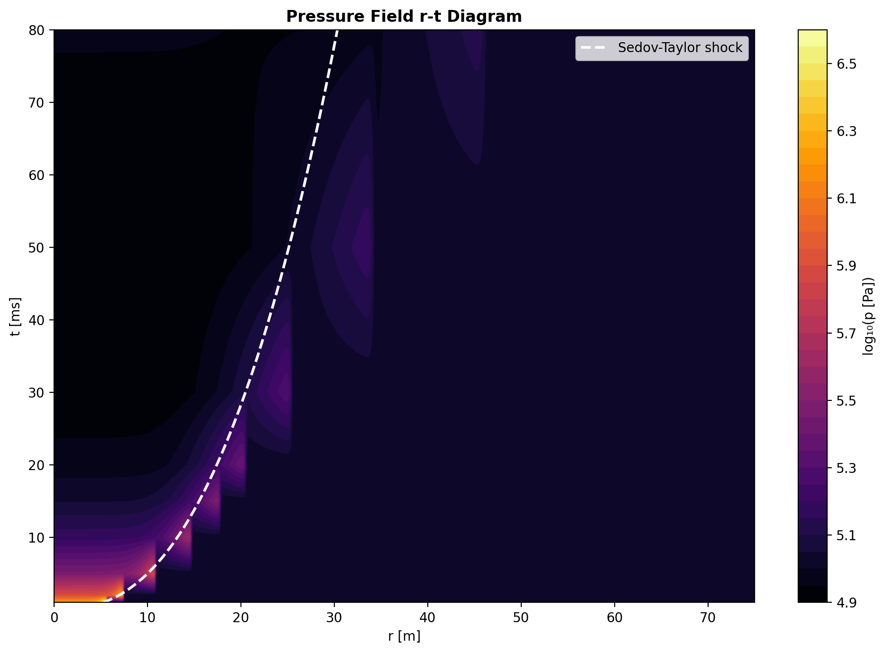
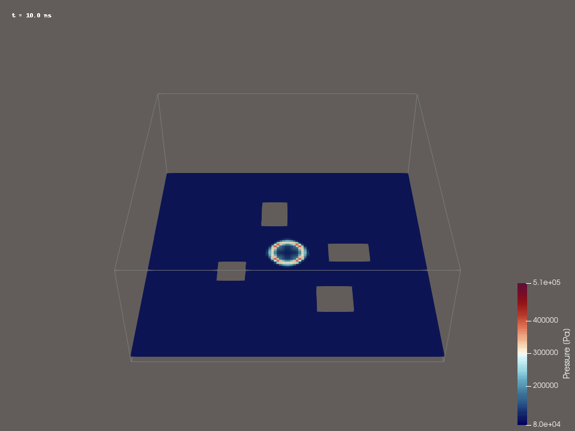
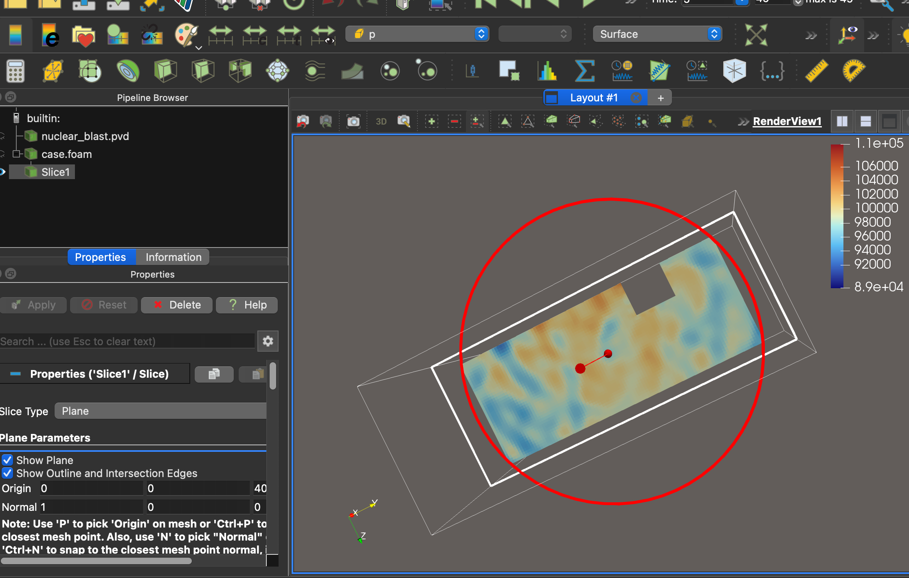

# Blast Wave Simulation

A comprehensive blast wave simulation framework combining analytical solutions, numerical CFD, and multi-platform 3D visualization. Covers conventional and nuclear-scale explosions with Sedov-Taylor theory, Rankine-Hugoniot shock relations, and Glasstone-Dolan empirical models.



## Features

- **1D Spherical Euler Solver** — Finite volume method with HLL Riemann solver and Strang splitting for geometric source terms
- **Sedov-Taylor Analytical Solution** — Exact self-similar solution for strong point explosions
- **Rankine-Hugoniot Shock Analysis** — Jump conditions across the shock front (pressure, density, temperature, velocity)
- **Glasstone-Dolan Nuclear Model** — Empirical overpressure model calibrated to nuclear test data (1977 US government publication)
- **Hopkinson-Cranz Scaling** — Universal scaled-distance overpressure curves
- **3D OpenFOAM CFD** — Full 3D compressible flow simulation with buildings using `shockFluid` solver
- **Blender Visualization** — Animated 3D blast wave with expanding shock sphere and pressure-mapped shells
- **ParaView Visualization** — Scientific 3D visualization with VTK export, slices, isosurfaces, and volume rendering

## Results Gallery

### Nuclear Blast Damage Map — Little Boy (Hiroshima, 15 kT)



Concentric damage zones computed from the Glasstone-Dolan overpressure model:
- **Total destruction** (140 kPa): 0.6 km
- **Severe damage** (35 kPa): 1.2 km
- **Light damage / window breakage** (7 kPa): 3.7 km
- **3rd degree burns** (10 cal/cm²): 1.5 km

### Overpressure Analysis


Four-panel analysis:
1. Overpressure vs distance for 6 historical weapons (Little Boy through Tsar Bomba)
2. Damage radii comparison (bar chart)
3. Shock wave propagation R(t) from Sedov-Taylor theory
4. Hopkinson-Cranz universal scaling (all yields collapse to one curve)

### 1D Numerical Simulation — Blast Wave Profiles



Density, velocity, and pressure radial profiles at multiple time steps. Dashed vertical lines indicate the Sedov-Taylor analytical shock position.

### Shock Trajectory — Numerical vs Analytical



Comparison of numerically detected shock position (red dots) against the Sedov-Taylor R(t) ∝ t^(2/5) scaling law (blue line). Log-log plot confirms the 2/5 power law.

### Pressure r-t Contour



Space-time diagram of the pressure field. White dashed line shows the Sedov-Taylor shock trajectory.

### 3D OpenFOAM CFD — Blast Wave with Buildings (Animated)



Shock wave propagation through an urban environment (50 frames, t = 10–500 ms). The wave diffracts around buildings, creating shadow zones and reflected pressure peaks.

### 3D OpenFOAM CFD — Pressure Slice (ParaView)



Full 3D compressible flow simulation (OpenFOAM `shockFluid` solver) with 4 buildings in a 200m × 200m × 80m domain. Horizontal slice at z = 5m showing the pressure field. Key observations:
- Shock wave **diffracts** around buildings, creating complex pressure patterns
- **Shadow zones** (low pressure) form behind structures
- **Reflection** off building walls amplifies local overpressure
- This asymmetry is **impossible to capture with 1D simulations**

### ParaView — 1D→3D Spherical Blast (VTK)


Spherically symmetric pressure field exported as 3D VTK rectilinear grid (80×80×40 cells). Time series viewable in ParaView with color mapping, slices, contours, and volume rendering.

### Blender 3D Visualization


Animated 3D visualization with:
- Expanding shock wave sphere (orange, semi-transparent)
- High-pressure core (yellow-white emission)
- Ground-level pressure rings
- Distance markers (10m, 20m, 30m, 50m)

## Project Structure

```
.
├── blast_simulation.py        # Core 1D spherical Euler solver + Sedov-Taylor
├── blast_nuclear.py           # Nuclear-scale simulation + Glasstone-Dolan model
├── export_paraview.py         # VTK export for ParaView (1D → 3D)
├── export_blender_data.py     # Blender-compatible .npz export
├── blender_blast_v2.py        # Blender Python visualization script
├── blender_blast.py           # Blender visualization (shell-based, v1)
├── blender_fix_view.py        # Blender viewport fix utility
│
├── openfoam_blast/            # OpenFOAM 3D CFD case (buildings + blast)
│   ├── 0/                     # Initial conditions (p, T, U)
│   ├── constant/              # Thermophysical properties, mesh
│   ├── system/                # Solver settings, mesh generation
│   ├── 0.01/ ... 0.2/        # Time step output directories
│   ├── case.foam              # ParaView loader file
│   └── run.sh                 # Execution script
│
└── results/                   # All output files
    ├── blast_profiles.png
    ├── blast_shock_trajectory.png
    ├── blast_pressure_rt.png
    ├── blast_overpressure.png
    ├── nuclear_overpressure.png
    ├── nuclear_damage_map_hiroshima.png
    ├── nuclear_profiles.png
    ├── blast.pvd              # ParaView time series (conventional)
    ├── nuclear_blast.pvd      # ParaView time series (nuclear)
    ├── vtk/                   # VTK 3D data files
    ├── vtk_nuclear/           # VTK 3D data files (nuclear)
    ├── blast_blender.npz      # Blender animation data
    ├── blast_wave_v2.blend    # Blender project file
    └── blast_frame_*.png      # Rendered animation frames
```

## Physics & Methods

### Governing Equations

1D spherically symmetric compressible Euler equations with geometric source terms:

```
∂ρ/∂t + ∂(ρu)/∂r = −2ρu/r
∂(ρu)/∂t + ∂(ρu²+p)/∂r = −2ρu²/r
∂E/∂t + ∂((E+p)u)/∂r = −2(E+p)u/r
```

where ρ is density, u is radial velocity, p is pressure, and E is total energy density.

### Numerical Method

| Component | Method |
|-----------|--------|
| Spatial discretization | Finite Volume Method (Godunov-type) |
| Riemann solver | HLL (Harten-Lax-van Leer) |
| Time integration | Strang splitting (flux + geometric source) |
| Geometric source terms | Semi-implicit (stability at r→0) |
| CFL number | 0.3–0.45 |

### Sedov-Taylor Self-Similar Solution

For a point explosion with energy E₀ in a uniform medium with density ρ₀:

```
R(t) = ξ₀ · (E₀/ρ₀)^(1/5) · t^(2/5)
```

where ξ₀ = α^(−1/5) and α is the Sedov constant (α ≈ 0.851 for γ = 1.4, d = 3).

### Rankine-Hugoniot Relations

Across a shock with Mach number Ms:

```
p₂/p₁ = (2γMs² − (γ−1)) / (γ+1)
ρ₂/ρ₁ = ((γ+1)Ms²) / ((γ−1)Ms² + 2)
T₂/T₁ = (p₂/p₁) / (ρ₂/ρ₁)
```

### Glasstone-Dolan Nuclear Model

Overpressure as a function of scaled distance Z = R / W^(1/3):

```
ΔP = P₀ · (0.84/Z + 2.7/Z² + 7.05/Z³)
```

where W is the TNT equivalent mass [kg] and P₀ is atmospheric pressure.

Reference: Glasstone & Dolan, *"The Effects of Nuclear Weapons"*, 1977 (US Government publication).

### 3D CFD (OpenFOAM)

| Parameter | Value |
|-----------|-------|
| Solver | shockFluid (OpenFOAM 11) |
| Domain | 200m × 200m × 80m |
| Buildings | 4 structures (15–50m height) |
| Mesh cells | 447,055 (snappyHexMesh) |
| Equation of state | Perfect gas (air, γ = 1.4) |
| Turbulence | Laminar (shock-dominated flow) |
| Boundary | Wave-transmissive (non-reflecting) |

## Nuclear Weapons Data

All data from publicly available sources (Glasstone-Dolan 1977, declassified US government reports).

| Weapon | Yield | Fireball | Total Destruction | Severe Damage | Light Damage |
|--------|-------|----------|-------------------|---------------|--------------|
| Little Boy (Hiroshima) | 15 kT | 102 m | 0.6 km | 1.2 km | 3.7 km |
| Fat Man (Nagasaki) | 21 kT | 116 m | 0.6 km | 1.3 km | 4.2 km |
| W-76 (SLBM warhead) | 100 kT | 217 m | 1.1 km | 2.3 km | 7.0 km |
| B-83 (largest US bomb) | 1,200 kT | 586 m | 2.5 km | 5.2 km | 16.1 km |
| Tsar Bomba | 50,000 kT | 2,607 m | 8.7 km | 18.0 km | 55.9 km |

## Requirements

### Python (core simulation)
```
Python >= 3.10
numpy
scipy
matplotlib
```

### VTK export (ParaView)
```
pip install vtk
```

### 3D Visualization
- **ParaView** (>= 5.10) — Scientific visualization
- **Blender** (>= 4.0) — 3D rendering and animation

### 3D CFD
- **Docker** — For running OpenFOAM on macOS/Windows
- **OpenFOAM 11** — Docker image: `openfoam/openfoam11-paraview510`

## Quick Start

### 1. Run the conventional blast simulation
```bash
python3 blast_simulation.py
```
Outputs: `results/blast_profiles.png`, `blast_shock_trajectory.png`, `blast_pressure_rt.png`, `blast_overpressure.png`

### 2. Run the nuclear blast simulation
```bash
python3 blast_nuclear.py
```
Outputs: `results/nuclear_overpressure.png`, `nuclear_damage_map_hiroshima.png`, `nuclear_profiles.png`

### 3. Export and view in ParaView
```bash
python3 export_paraview.py
paraview results/blast.pvd          # Conventional
paraview results/nuclear_blast.pvd  # Nuclear
```

### 4. Export and view in Blender
```bash
python3 export_blender_data.py
blender --python blender_blast_v2.py
```

### 5. Run 3D OpenFOAM simulation (Docker)
```bash
# Mesh generation + solver
docker run --rm --entrypoint "" \
  -v $(pwd)/openfoam_blast:/case -w /case \
  openfoam/openfoam11-paraview510 \
  bash -c "source /opt/openfoam11/etc/bashrc && \
           blockMesh && snappyHexMesh -overwrite && \
           setFields && foamRun -solver shockFluid"

# View results
paraview openfoam_blast/case.foam
```

## Customization

### Change explosion energy
Edit `BlastParams` in `blast_simulation.py`:
```python
params = BlastParams(
    E0=4.184e9,    # Energy in Joules (4.184e6 J = 1 kg TNT)
    r_max=200.0,   # Domain radius [m]
    Nr=3000,       # Grid resolution
    t_end=0.08,    # Simulation end time [s]
)
```

### Change nuclear yield
Edit `blast_nuclear.py`:
```python
WEAPONS = {
    'Custom': {
        'yield_kT': 100,        # Yield in kilotons TNT
        'description': 'Custom weapon',
        'burst_height_m': 500,  # Burst height [m]
        'color': '#3498db',
    },
}
```

### Modify OpenFOAM buildings
Edit `openfoam_blast/system/snappyHexMeshDict` to add/remove/resize buildings:
```
building_new
{
    type searchableBox;
    min (x1 y1 0);
    max (x2 y2 height);
}
```

## References

1. Taylor, G.I. (1950). "The Formation of a Blast Wave by a Very Intense Explosion." *Proc. R. Soc. Lond. A*, 201(1065), 159–174.
2. Sedov, L.I. (1959). *Similarity and Dimensional Methods in Mechanics*. Academic Press.
3. Glasstone, S. & Dolan, P.J. (1977). *The Effects of Nuclear Weapons* (3rd ed.). US Government Printing Office.
4. Brode, H.L. (1955). "Numerical Solutions of Spherical Blast Waves." *J. Appl. Phys.*, 26(6), 766–775.
5. Kinney, G.F. & Graham, K.J. (1985). *Explosive Shocks in Air* (2nd ed.). Springer.
6. Korobeinikov, V.P. (1991). *Problems of Point Blast Theory*. American Institute of Physics.

## License

This project is for educational and research purposes. All nuclear weapons data is from publicly available, declassified government publications.
